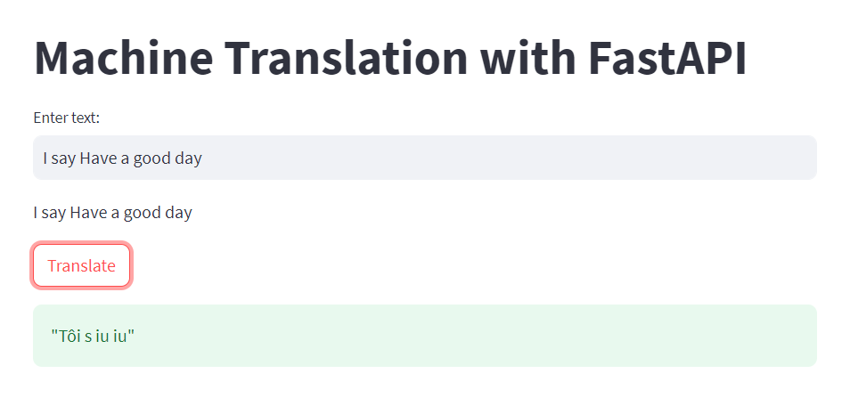

<!-- ABOUT THE PROJECT -->
## About The Project

This is a mini project to implement Machine translation from english to vietnamese. 

Here's overview of the project:
* You run the app and input english sentences. 
* Model will return the translated text to vietnamese. 

<!-- GETTING STARTED -->
## Getting Started

This is an example of how you may give instructions on setting up your project locally.
To get a local copy up and running follow these simple example steps.

### Prerequisites
You need to install these packages

* streamlit
  ```sh
  pip install streamlit
  ```
* fastapi
  ```sh
  pip install fastapi
  ```

<!-- USAGE EXAMPLES -->
## Usage

Use this space to show useful examples of how a project can be used. Additional screenshots, code examples and demos work well in this space. You may also link to more resources.

1. Clone the repo
   ```sh
   git clone https://github.com/huyhoanlee/Machine-Translation-eng2vi.git
   ```
   Run the `Translation_en_vi.ipynb` to train and save model. I already named the model's weight file as 'translator_model'.

2. Make sure API is runed
   ```sh
   uvicorn api:app --reload
   ```
3. Open front end 
   ```sh
   streamlit run app.py
   ```
Then we have the result as below. I just trained some epoch so the output is not good. 
  
<br>

<!-- CONTACT -->
## Contact

Le Huy Hoan - hoanle2003@gmail.com

